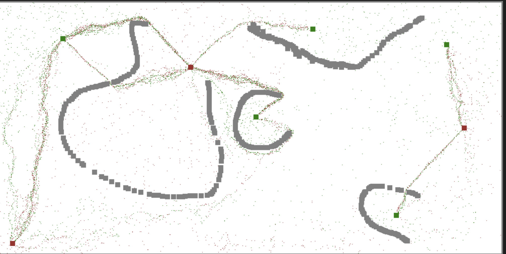
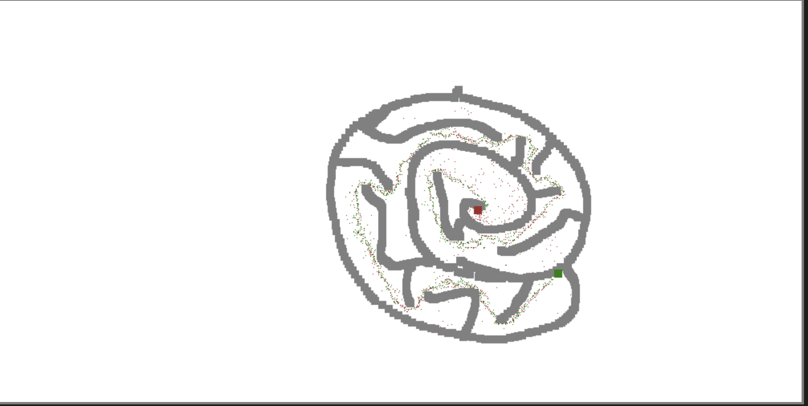
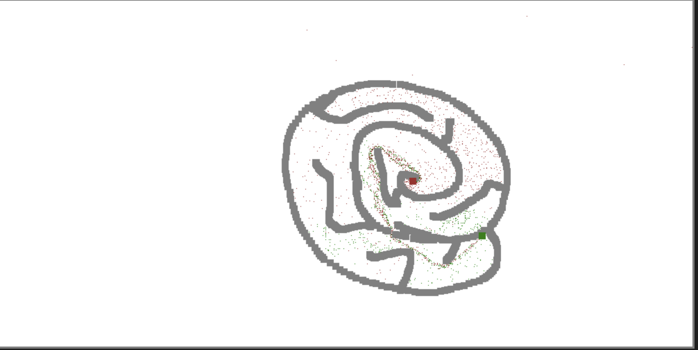
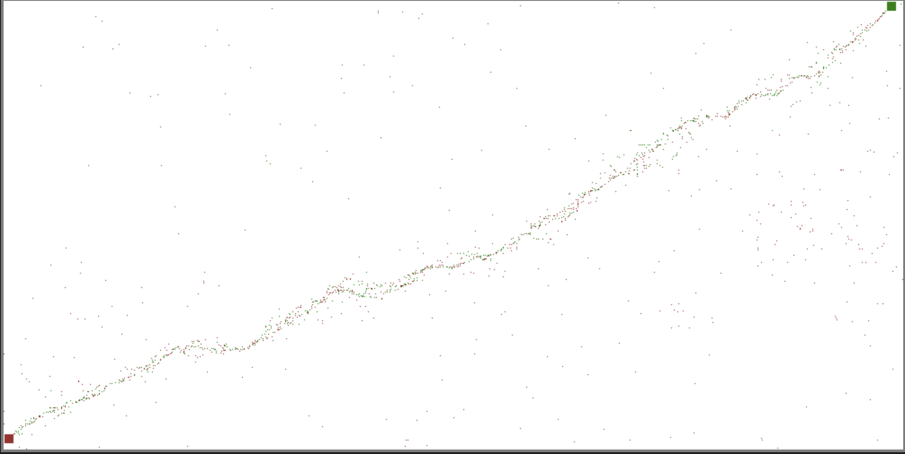
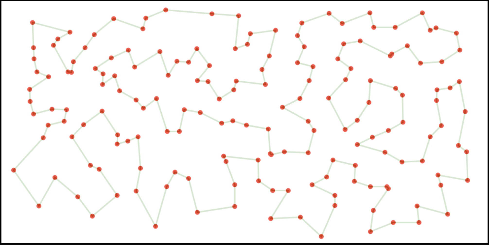
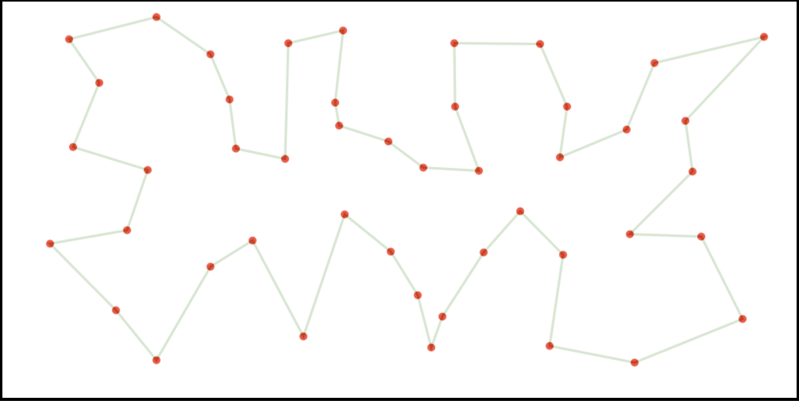
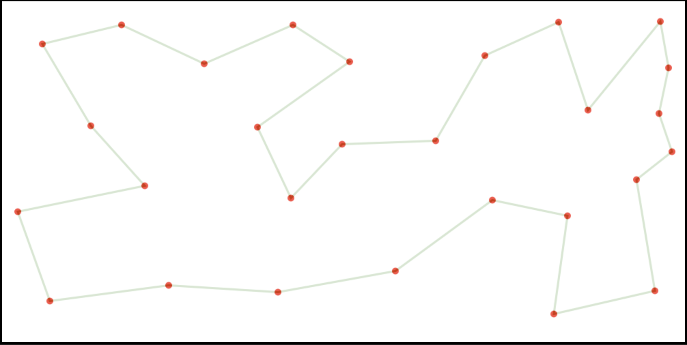
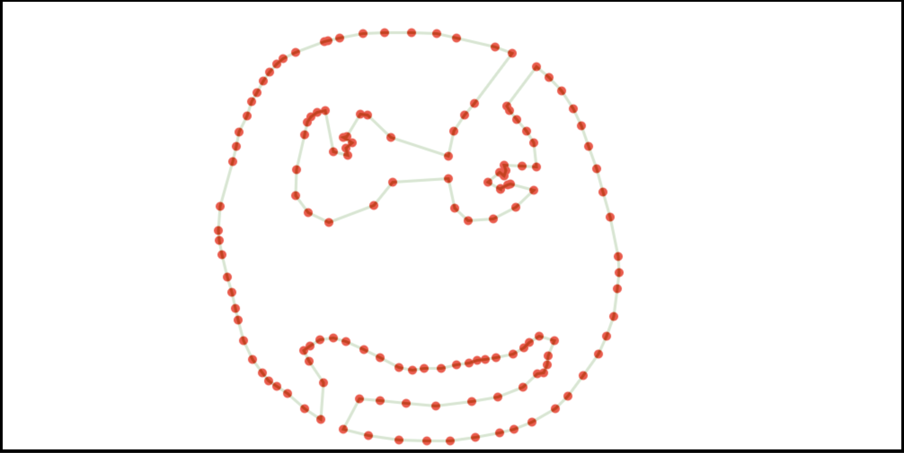

# Team608

<h1>Кратко</h1>
Проект: разработка веб-приложения с визуализацией алгоритмов за 1 месяц (команда из 3 человек).Мой вклад: расширенная симуляция муравьиной колонии и улучшенный генетический алгоритм.Ключевая проблема: оптимизация (баланс между памятью и производительностью).Решение: отказ от памяти агентов, переход к случайному блужданию с добавлением стохастики и эвристик.Результат: все алгоритмы защищены на максимальный балл, муравьиный алгоритм признан лучшим.

<hl>
<h1>Подробно</h1>
Предыстория.
    У алгоритмов есть базовый и бонусный варианты (бонусный - это расширенный и/или усложненный вариант реализации предложенного алгоритма). Если планируете делать бонусный вариант какого-либо алгоритма, то его базовый вариант в таком случае делать НЕ обязательно (Если не указано обратное).
    При желании группа студентов может договориться и реализовать кроме предложенного бонусного варианта собственную модификацию или усложнение к данному алгоритму. Если усложнение достаточно интересное и/или сложное, то оно оценивается дополнительными баллами для группы.
	Стандартные правила на запрет использования готовых решений или использование генеративных языковых моделей для генерации кода - по-прежнему работает(Уточнение, для обучающей выборки или тестовых данных - можно использовать готовые дата-сеты, но сам алгоритм его имплементация и работа - должны быть обеспечены работой группы)

Задача
Реализовать набор алгоритмов, а также их визуализацию и интерфейс в виде браузерного веб-приложения.

Алгоритмы для реализации А* 
Базовый вариант - ваше приложение позволяет сгенерировать квадратную карту размером n*n, настроить эту карту, разместив на ней непроходимые клетки, клетку начала и конца пути. Далее при запуске алгоритма по одной эвристике показывается найденный маршрут или выводится, что маршрута не существует.
Бонусный вариант - вы генерируете карту-лабиринт (можно использовать алгоритмы генерации лабиринтов на основе алгоритмов Прима/Краскала) на карте размером n*n, вы позволяете пользователю модернизировать этот лабиринт, добавив/убавив непроходимые клетки, клетку начала и конца пути. Далее при запуске отрисовывается анимация поиска и прохождения пути на каждой итерации алгоритма (вы показываете, какие клетки рассматриваются алгоритмом, какие выбраны и какие анализируются для построения маршрута) в режиме реального времени.

Алгоритм кластеризации
Базовый вариант - ваше приложение генерирует плоскость, на которой пользователь может кликами расставлять точки для будущей кластеризации. Далее запускается алгоритм, который показывает найденные кластеры (цветом или поделив плоскости на области кластеры). Достаточно одного из варианта определения кластеров (например K-средних)
Бонусный вариант - вы реализовываете несколько вариантов определения кластеров и при запуске вашего алгоритма отдельно выделяете и показываете точки, которые в зависимости от используемой метрики относятся к разным кластерам, с указанием, к какому кластеру по какой метрике они относятся

Генетический алгоритм
Базовый вариант - решение задачи коммивояжёра. Вы генерируете плоскость, на которой пользователь расставляет точки - вершины графа. Веса ребёр - расстояние на плоскости между вершинами. Ваша задача - реализовать генетический алгоритм, который построит путь коммивояжера по этому графу. Пока алгоритм работает, вы показываете лучшую особь на последней достигнутой итерации алгоритма. Следовательно, при завершении алгоритма лучшая особь - потенциально лучший путь коммивояжера.
Бонусный вариант (В прошлом ЧК на 6ой модуль) - Ваша задача - реализовать генетический алгоритм, который в качестве особи получает полноценный работающий АЛГОРИТМ написанный на каком либо общепринятом языке программирования, решающий задачу поиск n-ого числа Фибоначчи. Данный расширенный вариант можно делать не как веб-приложение

Муравьиный алгоритм
Базовый вариант - решение задачи коммивояжёра. Вы генерируете плоскость, на которой пользователь расставляет точки - вершины графа. Ваша задача - реализовать муравьиный алгоритм, который построит путь коммивояжёра по этому графу.
Бонусный вариант - Оптимизация муравьиной колонии. 
Вы генерируете карту (лабиринт), куда расставляется муравьиная колония (единый центр) и несколько точек с источниками еды (у каждой в отдельности можно редактировать её питательность, какое-то числовое значение, считаем что источники еды бесконечные). Можно указать количество муравьёв в колонии. Муравьи не знают путей до еды, они должны найти пути до источников еды и оптимизировать маршруты и нагруз до них используя принцип муравьиных феромонов. В качестве ориентира бонусного варианта(https://youtu.be/emRXBr5JvoY). Оптимизация нагрузки до источника еды должна происходить за счет анализа феромонного следа, и учитывать суммарно и длину пути и питательность источника, и количество муравьев которые уже на маршруте
Дерево решений
Базовый вариант - вы даете пользователю возможность ввести обучающую выборку в формате csv-текста, на основе которой строится дерево решений. Получив его, вы показываете его пользователю. Далее ваше приложение позволяет вводить данные в формате csv-текста для принятия решения по дереву. Вы прогоняете введенный элемент по дереву, отображая принятое решение и его путь на каждом узле дерева
Бонусный вариант - Помимо базового варианта вы добавляете возможность оптимизировать размер полученного дерева

Нейронная сеть
Базовый вариант - ваша нейронная сеть работает с пиксельным изображением размером 5 на 5 (25 пикселей). Пользователь может рисовать цифры за счёт покраски отдельных пикселей (смена чёрного на белый цвет и обратно). Ваша нейронная сеть понимает, какая цифра нарисована, и показывает это пользователю.
Бонусный вариант - ваша нейронная сеть работает с пиксельным изображением 50 на 50 пикселей, пользователь рисует цифры за счёт закрашивания пикселей (аналог рисования ручкой или спреем в paint), ваша нейронная сеть определяет нарисованную цифру и выводит пользователю

Дедлайн: месяц

Команда.
3 человека. Постфактум каждый из участников независимо друг от друга выбрал для себя набор алгоритмов и реализовал наиболее предпочтительный вариант.

Личный вклад в проект
Отвечал за разработку расширенной версии муравьиного алгоритма. В процессе реализации были добавлены дополнительные механики и усложнения, что в итоге привело к созданию полноценной симуляции муравьиной колонии.
* Реализован интерактивный режим: пользователь может в реальном времени добавлять и удалять препятствия без перезапуска симуляции.
* Внедрена механика ограниченности ресурсов: источники пищи могут быть как бесконечными, так и исчерпаемыми. Потребление реализовано на уровне взаимодействия агентов с ресурсом и не привязано к таймеру.
* Добавлена возможность размещения неограниченного кол-ва источников пищи в пространстве.
* Реализована поддержка неограниченного кол-ва муравейников с динамическим и равномерным распределением нагрузки между ними.
* Обеспечена возможность изменения параметров симуляции в реальном времени, включая:
    * параметры феромонов (стойкость, привлекательность);
    * параметры испарения (скорость и интенсивность);
    * характеристики агента (вероятность и угол отклонения, вероятность ошибки и др.);
    * параметры популяции (размер агента, количество особей, максимальная длина пути до истощения и смерти агента);
    * параметры ресурсов (питательность пищи);
    * скорость симуляции (до ×10 от базовой).
* Реализованы инструменты кастомизации кисти для рисования и удаления объектов в процессе работы симуляции.
* Создано масштабное пространство моделирования (1000×500 у.ед) при отсутствии у агентов памяти, зрения и механизмов сканирования среды: каждый агент выполняет только локальные шаги размером 1×1 у.ед, что существенно усложняет задачу и повышает реалистичность модели, исключая любые возможности простого перебора.
* Создана и оптимизирована возможность добавления на поле большого кол-ва агентов
Все перечисленные функции работают в условиях реального времени и полной интерактивности.

Занимался реализацией базовой версии генетического алгоритма с рядом расширений:
* алгоритм адаптирован для работы с большими выборками точек.

Проблемы и их решения.
Ключевой сложностью проекта стала оптимизация алгоритма. Из-за большого пространства поиска вероятность нахождения решения при небольшой численности колонии была крайне низкой: увеличение числа агентов ускоряло сходимость, но одновременно существенно повышало нагрузку на вычислительные ресурсы.
На начальном этапе алгоритм использовал различные подходы к запоминанию (хранение всех траекторий, лучшего маршрута, сжатие путей и другие методы мемоизации). Однако даже при сравнительно небольшой колонии (500–800 агентов) потребление оперативной памяти достигало 2–6 ГБ для нахождения первого допустимого решения. Попытки снизить потребление памяти за счёт сокращения или полного отказа от мемоизации привели к перераспределению нагрузки на анализ локального окружения агента, что, в свою очередь, резко снизило производительность симуляции.
Несмотря на проведённые локальные оптимизации (улучшение алгоритмов, оптимизация отрисовки и генерации чанков), проблема оставалась нерешённой. В результате было принято принципиальное решение полностью отказаться от памяти агента и механизмов «зрения». На разработку, реализацию и тестирование нового подхода ушло около трёх недель при общем дедлайне в четыре недели. В качестве альтернативы был реализован механизм случайного блуждания с использованием полярных координат для хранения вектора движения агента, что обеспечило устойчивый поиск путей независимо от расстояния до цели и времени поиска без зависимости от памяти и локального сканирования.
Однако данный подход привёл к новой проблеме — стагнации в локальных оптимумах: алгоритм находил решения, но слабо их улучшал и практически не открывал новые, более эффективные маршруты. Для её решения была введена вероятность ошибки (случайные отклонения в движении агентов), что позволило преодолевать локальные оптимумы, улучшить глобальный поиск и повысить качество решений.
Дополнительной сложностью стало неэффективное распределение агентов: при длительном блуждании часть из них выходила за пределы полезных областей, не внося вклад в общее решение, но продолжая потреблять ресурсы. Для устранения этого была внедрена эвристика истощения и смерти агентов. Аналогичный механизм применялся в случаях, когда агенты оказывались заблокированными препятствиями.
Также возникали проблемы с застреванием агентов в тупиках и их неспособностью адаптироваться к динамическим изменениям среды (например, при появлении препятствий на ранее найденных маршрутах). Дополнительно наблюдались циклические зависимости, при которых агенты разных состояний («голодные» и «сытые») зацикливались на феромонных следах друг друга. Решением стало изменение модели испарения феромонов: вместо плавного процесса было введено дискретное испарение с заданным интервалом в n итераций.
Однако такой подход вызвал эффект «массовой амнезии» — резкую потерю накопленной информации. Для его устранения был реализован механизм амортизированного испарения, позволяющий сохранить баланс между скоростью забывания и стабильностью накопленных данных.

В части генетического алгоритма была реализована базовая версия с дополнительной эвристикой, направленной на предотвращение преждевременной сходимости и выхода из локальных оптимумов, что повысило устойчивость и скорость поиска глобально оптимальных решений.

Итоговый результат.
Команда успешно защитила все реализованные алгоритмы, получив максимальную оценку:
* расширенный вариант алгоритма A*;
* расширенные варианты алгоритмов кластеризации;
* базовая версия генетического алгоритма;
* расширенный вариант муравьиного алгоритма (моя реализация признана лучшей среди представленных решений);
* расширенный вариант алгоритма дерева решений;
* расширенный вариант нейронной сети.
